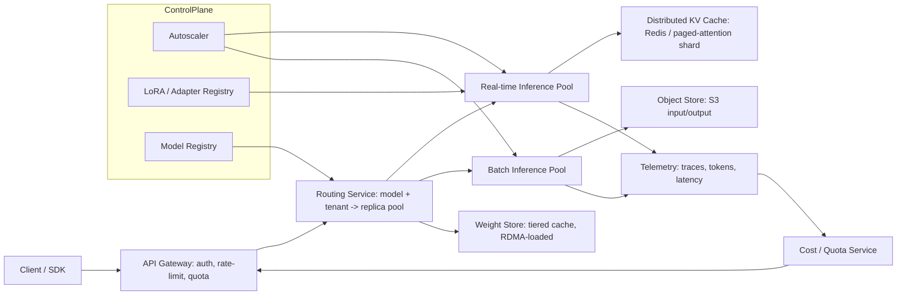

# System Design: Multi-tenant LLM Inference Serving Platform

**Prompt (interviewer-style):** Design a multi-tenant LLM inference platform that serves models from 7B to 70B parameters, supports both real-time chat and batch inference, hits a p95 < 500 ms for first token, and serves thousands of tenants with strong isolation and per-tenant cost accounting.

Target audience: Anthropic / OpenAI / Modal / Together / Fireworks / Baseten / Hugging Face.

---

## 1. Requirements (5 min)

### Functional
- Real-time chat: streaming token output, p95 TTFT < 500 ms, p95 TPOT < 50 ms.
- Batch inference: best-effort, throughput-optimized.
- Multi-model: 7B, 13B, 34B, 70B. Mix of base + fine-tunes. LoRA-style adapters for fine-tunes.
- Multi-tenant isolation: noisy-neighbor protection; per-tenant rate limits; per-tenant cost accounting and quotas.
- Observability: traces, token counts, latency, error budget per model + per tenant.
- Safety/policy: input/output filters as middleware.

### Non-functional
- Scale: ~10k tenants, peak ~100 RPS real-time per tenant, batch peaks 10x real-time.
- Availability: 99.9% (chat) / 99.99% (batch eventually).
- Cost: GPUs are the dominant cost; aim for >70% utilization without hurting latency SLO.

### Out of scope
- Training. Embeddings (a separate service). UI.

## 2. High-level architecture

## 3. Key design choices

### Engine
- **vLLM** as the inference engine for OSS / open-weights models — PagedAttention, continuous batching, prefix caching.
- For frontier closed models, a managed engine (e.g. TensorRT-LLM with Triton, or in-house). Keep the abstraction at the **Router** boundary: `model_id -> engine_endpoint`.

### Continuous batching + speculative decoding
- Continuous batching is the workhorse for utilization. Decoder steps batch together; prefill is the hotspot.
- **Speculative decoding** (small draft model + big target model) for chat models — typical 2-3x throughput at small latency cost.

### Prefix cache
- Conversation prefixes are highly reusable (system prompt + chat history). vLLM's prefix cache + a **distributed** prefix cache (Redis/shared paged shards) for cross-replica reuse.
- Cache key = `(model_id, lora_id, sha256(token_ids[:N]))`. TTL by tenant.

### LoRA / adapter routing
- Tenants share base weights; adapters are small (10s of MB). Mount adapters at load time; route requests with adapter sets that fit a replica.
- "Adapter-stickiness" in the router — keep a tenant's traffic on replicas already loaded with their adapter, fall back to a cold-load with a small penalty.

### KV cache
- KV cache is the biggest VRAM line item. PagedAttention amortizes fragmentation.
- For very long contexts, offload to CPU/host memory with NVLink/PCIe transfer (vLLM's CPU offload). Beyond that, paged offload to NVMe / object store.

### Speculative serving tiers
- **Tier-0** (chat): real-time pool, large replicas, low queue depth target.
- **Tier-1** (interactive batch): higher queue depth, lower per-token cost.
- **Tier-2** (overnight batch): preemptible GPUs, S3 in/out, no SLO.

### Autoscaling
- Per-model HPA: signal = `queue_depth` + `tokens_in_flight`, not CPU.
- Cold-start mitigation: prewarmed pool of "empty" replicas; load weights lazily from RDMA-backed weight cache (Triton model repository pattern).
- Spot/preemptible for Tier-2.

## 4. Multi-tenancy and cost

- **Quota** per tenant: tokens/min, RPS, parallel requests, monthly token budget.
- **Per-tenant cost** = `sum(tokens) * (model_price + adapter_overhead)` at write to a **cost-event topic** (Kafka/Pub-Sub).
- Cost-events fed to a billing rollup and to the **circuit breaker** in the API gateway (real-time quota enforcement).

This is the part of the design where my **OpenClaw cost-aware runtime** experience is on-thesis: token / step / cost budgets enforced as a side-car policy on top of a model gateway, with rolling cost/latency aggregates and manual pricing overrides for non-standard SKUs.

## 5. Reliability + isolation

- **Cell-based deployment**: each tenant pinned to a cell (e.g. AWS region + cluster). A failed cell takes down ~5% of tenants, not the world.
- **Per-tenant token bucket** in the gateway. Headroom on top per cell.
- **Circuit breaker** at the router — if a model's error rate >5% in 1 min, shed to a fallback model (smaller or different vendor) with a `degraded=true` header.

## 6. Observability

- **Per request:** trace_id, tenant_id, model_id, lora_id, prompt_token_count, generated_token_count, TTFT, TPOT, queue_time, cache_hit (prefix), GPU_time.
- **Per replica:** tokens/sec, KV cache occupancy, prefill_vs_decode ratio.
- **Pipelines:** OpenTelemetry → Tempo / Jaeger; metrics → Prometheus → Grafana; logs → Loki.
- LLM-specific: Langfuse for prompt/response sample traces (compliance-aware sampling).

## 7. Safety / policy

- Pre-filter (PII redaction, jailbreak detect) and post-filter (toxicity, regulated-content scoring) as middleware in the gateway. Both are themselves smaller models.
- Per-tenant safety policy (configurable; e.g. medical vs general).

## 8. Failure modes I'd specifically prepare for

| Failure | Detection | Mitigation |
|---------|-----------|------------|
| Cold-load stampede after autoscale | sudden TTFT spike | Pre-warmed empty replicas + weight RDMA cache |
| One tenant exhausts adapter slots | adapter-load latency | Adapter slot quota per tenant; LRU eviction |
| Prefix cache poisoning across tenants | none direct | Cache key includes tenant_id; never share across tenants |
| KV cache OOM | OOMKilled | Per-request max_tokens enforced; admission control on queue depth |
| Speculative decoder rejection rate spikes | acceptance % monitor | Auto-disable speculation per (model, traffic-segment) |
| Slow / hung tenant | request-age dashboard | Hard timeout; cancel in-flight (vLLM async cancel) |

## 9. Talking points I'd bring up

- "I built a cost-aware runtime for browser agents — same shape of problem here: cost as a first-class control plane signal, not a billing afterthought."
- "Continuous batching is the right default; speculative decoding is the next 2x. We measure acceptance rate and disable when it's a loss."
- "Multi-tenancy is mostly about a few cross-cutting controls: quota at the gate, adapter affinity at the router, prefix-cache keying that's tenant-safe."
- "I'd run cell-based from day 1 even at small scale — it's cheap insurance and unlocks gradual rollouts."

## 10. What I'd ask the interviewer

- "Are tenants known at deploy time, or self-serve? That changes the gateway story."
- "How important is open-weights vs closed-weights mix? It changes the engine abstraction."
- "What's the chat vs batch ratio?"

---

## Source notes for self-study

- vLLM paper (Kwon et al, 2023) — PagedAttention.
- Anthropic blog on Claude infra (public talks).
- Together AI blog on speculative decoding numbers.
- Modal docs on cold start / weight cache.
- "Continuous batching to increase throughput by ~23x" — Anyscale post.
