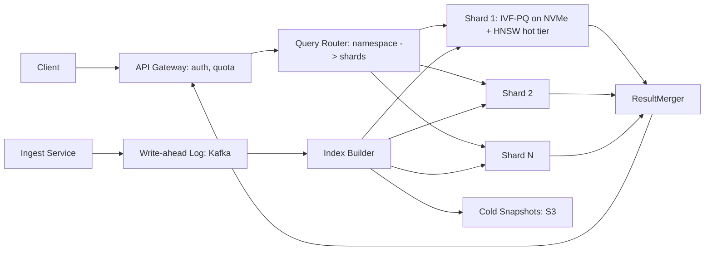

# System Design: Vector Database at Scale

**Prompt:** Design a managed vector database service that ingests billions of vectors, supports p95 < 50 ms ANN search at 1B vectors per namespace, hybrid (sparse + dense) search, and per-tenant isolation. Target Pinecone / Weaviate / Vertex Vector Search.

---

## 1. Requirements (5 min)

### Functional
- Insert / update / delete vectors with attached metadata.
- ANN query: top-k by cosine / dot / Euclidean. p95 < 50 ms at 1B vectors / namespace.
- Hybrid search: BM25 (sparse) + dense embedding combine.
- Metadata filtering (predicate pushdown into the index).
- Namespaces (per tenant / per app); strong isolation.
- Update freshness: < 5 s end-to-end (insert visible in query).

### Non-functional
- Multi-tenant, multi-region. 99.9% availability.
- Cost matters: SSDs and RAM dominate.

### Out of scope
- Embedding generation (separate service). UI.

## 2. Core problem: ANN data structures

- **HNSW** is the default for memory-resident; great recall, log query cost, hard to delete.
- **IVF + PQ (product quantization)** is the default for disk-resident at billion-scale; ScaNN, FAISS-IVF-PQ.
- **DiskANN / Vamana** for billion-scale on SSDs — read-amplification controlled by graph design.
- For < 10M vectors / namespace: HNSW in RAM. For > 100M: IVF-PQ on SSD; for 1B+: DiskANN.

This service is built on a **shard-and-replicate** model:

## 3. Write path

1. Insert → API gateway → Ingest service → WAL (Kafka, partition by namespace).
2. Two consumers:
   - **Hot writer:** appends to a per-shard *delta segment* in RAM (an HNSW or flat index sized for fresh data).
   - **Cold compactor:** background, merges delta segments into the main IVF-PQ index on SSD; rebuilds PQ codebooks per shard on a slower cadence.
3. Query path consults both delta + main index, then merges + re-ranks.

This is the **LSM-tree shape** of vector indexing — fresh writes are queryable instantly because the delta segment is RAM-resident, while the bulky main index is rebuilt asynchronously.

## 4. Read path

1. Gateway authenticates, applies per-tenant rate limit.
2. Router fans out the query to all shards in the namespace (or to a subset via partition pruning when filters narrow the namespace).
3. Each shard runs ANN on (delta + main) → top-K candidate set.
4. Result merger picks global top-k. Optional re-rank step (cross-encoder model) for the top 100 → top 10.
5. Metadata filter applied either as predicate pushdown into IVF (post-list scan) or as a candidate filter after ANN (cheaper when filters are non-selective).

## 5. Hybrid search

- Maintain a parallel BM25 inverted index per shard (Tantivy / Lucene-like).
- Run dense + sparse in parallel; combine via **Reciprocal Rank Fusion** or a learned reranker.
- Reranker is a small cross-encoder model, hosted on the inference service from design #1.

## 6. Sharding strategy

- Shard by `(namespace, hash(id) % N_shards)`. Namespaces fully co-located when small; spread across shards when large.
- **Resharding** is the hard part. Triggered when a shard exceeds size or QPS threshold:
  - Build double-write to old + new shard set.
  - Backfill new shards from cold snapshots in S3.
  - Catch up via WAL.
  - Cut over query router atomically.
- Each shard is replicated 3x for availability and read scale; primary handles writes; replicas serve reads. CRDT-like merge on delta segment? Not needed — the WAL is the source of truth.

## 7. Quantization choices

- For p95 < 50 ms at 1B vectors / namespace, IVF-PQ with `nlist ≈ 65k` and `m ≈ 64` codebooks (64-byte codes), trained per shard.
- Re-rank top candidates with full-precision vectors loaded from disk (a small fraction of candidates → minimal extra latency).
- ScaNN-style asymmetric distance computation is a measurable win.

## 8. Multi-tenancy

- Namespace = tenant boundary. Hard isolation: separate shards for large tenants; shared shards for small tenants (with strict tenant-id filtering at every read).
- Per-tenant quotas: vectors stored, QPS, parallel requests.
- "Noisy tenant" detection: per-tenant QPS + latency; throttle in gateway; auto-page if degradation breaches SLO.

## 9. Cost levers

- Tiered storage: hot (RAM), warm (NVMe), cold (S3). LRU eviction for inactive namespaces.
- PQ aggressiveness: more aggressive = cheaper memory but worse recall. Per-tenant SLA flag controls it.
- Spot instances for cold compaction; never for query path.

## 10. Failure modes

| Failure | Mitigation |
|---------|------------|
| Delta segment grows unbounded (stalled compaction) | Backpressure on ingest; SLO alarm on `delta_segment_age` |
| Reshard mid-flight failure | Idempotent: WAL replay completes the catch-up |
| Shard hot spot (single namespace) | Promote namespace to dedicated shard cluster |
| Drift in PQ codebook quality | Periodic recall regression test; auto-retrain codebooks when recall@10 < target |
| Cross-tenant leak | Defense in depth: tenant filter in router AND in shard query |

## 11. Observability

- **Per query:** trace_id, namespace, shard_set, candidates_per_shard, recall_estimate, latency by stage.
- **Per shard:** index size, delta size, compaction lag, PQ recall samples.
- **Per tenant:** rate, recall complaints (when re-rank ratio is bad).

## 12. What I'd ask

- "What's the recall target? 0.95? 0.99?" → drives PQ aggressiveness.
- "Is rerank in scope? Cross-encoders or just RRF?"
- "Are filters typically very selective or not?" → predicate-pushdown vs candidate-filter.

## 13. Things to drop in to sound senior

- "This is fundamentally an LSM-tree, just with vector indexes instead of sorted runs."
- "Reshard is the hardest operational story. I'd build double-write + WAL catch-up from day one, even before we need it — it's the difference between a 4-hour migration and a 4-day one."
- "PQ is a recall/cost lever, not a one-time choice. We measure recall continuously and retrain when it drifts."

---

## Source notes

- DiskANN (Microsoft Research) paper.
- ScaNN (Google) paper.
- Pinecone engineering blog.
- Weaviate docs (HNSW + dynamic index).
- FAISS index types overview.
