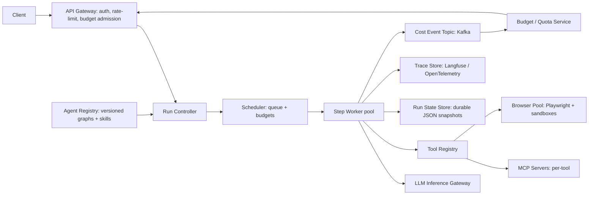

# System Design: Multi-Tenant Agent Orchestration Platform

**Prompt:** Design a platform that runs long-lived, multi-step LLM agents across thousands of tenants. Agents make tool calls, can call each other, can pause-resume, and require per-task budgets (tokens, cost, wallclock, steps). Think Sierra / Decagon / OpenAI Operator / a Claude Agent SDK hosting platform.

Direct overlap with my OpenClaw cost-aware runtime work — call it out explicitly in the interview.

---

## 1. Requirements

### Functional
- Define an agent (DAG or LangGraph-like) declaratively + a code SDK.
- Run an agent against an input; stream intermediate events; produce final output.
- Tool calls (HTTP/REST, MCP servers, internal RPCs, browser via Playwright).
- Sub-agents (one agent calls another).
- Pause-resume across hours/days (long-lived sessions).
- Per-task budgets: tokens, cost, wallclock, max-steps, max-tool-calls.
- Versioned agent definitions; A/B routing; eval harness.

### Non-functional
- ~10k tenants, ~100k concurrent sessions, ~1k agent runs/sec.
- p95 step latency dominated by LLM call (≤ 1 s).
- Strong tenant isolation. SOC 2 / SOC 3.

### Out of scope
- LLM serving (use design #1). UI.

## 2. Architecture

## 3. Run model

- Each agent run = a state machine. State = `{step, history, scratchpad, tool_results, budget_remaining}`.
- After every step, **snapshot to durable storage** (Postgres JSONB or DynamoDB) and emit trace + cost events.
- Resume = load snapshot, continue from `step+1`. This is what makes pause/resume practical at scale.
- Long-lived sessions use a **virtual actor pattern** (Orleans / Akka-style): one logical actor per `run_id`, scheduler can re-hydrate it on any worker.

## 4. Budgets and policy enforcement

Drawn directly from the OpenClaw cost-aware runtime plugin:

- Per-run budget set at admission: `{tokens, cost_usd, wallclock_s, max_steps, max_tool_calls}`.
- After every LLM call and every tool call, the worker emits a cost event AND consults the budget service.
- **Policy decision points** at step boundaries (post-action):
  - Allow, Allow-with-warning, Throttle, Halt, Escalate-to-human.
- Policies are pluggable: a tenant can ship its own policy (sandboxed), or use defaults.
- "Manual pricing overrides" (from OpenClaw): allow per-tenant pricing tables when models route to non-standard SKUs.

## 5. Tooling

- Tools are first-class registered objects with: name, schema, side-effect class (read-only / mutate-external / spend-money), cost-rate, auth scopes.
- Side-effect class drives policy. Read-only tools may bypass step budgets; money-spending tools always require fresh budget check.

### MCP integration
- Each MCP server is a tool host. Registry knows which servers expose which tools.
- Authentication: per-tenant credential vault; **credential bridge** patterns (like the Cursor × Claude Code MCP bridge I built at GEICO) for cross-product cred sharing where allowed.

### Browser tools (OpenClaw-style)
- Pool of disposable Playwright sandboxes (Browserbase-pattern); cost-aware policy on time and pages visited.
- Per-domain allowlists per tenant.

## 6. Sub-agents

- One agent invoking another is just a special tool call with the same budget machinery — parent's remaining budget can be passed down (split) or refreshed.
- Cycles guarded by `depth_limit` and a global step counter.

## 7. Versioning + evals

- Agent definitions versioned (`agent_id@semver`). Deployments choose version; A/B router can split traffic.
- Eval harness: stored eval suites of `(input, expected_output, eval_fn)`. New version must beat baseline by N% on `pass_rate` before promote.
- Trace-replay: replays a past run on a new agent version to compare divergences (great for regressions).

## 8. Multi-tenancy + isolation

- Run state, traces, cost events all keyed by `tenant_id`.
- Workers are tenant-shared but **per-tenant rate limits** and **per-tenant concurrency caps**.
- Tools that hit external services use per-tenant credentials (never shared).
- Browser sandboxes are single-use; never reused across tenants.

## 9. Observability

- **Run-level:** trace_id, tenant_id, agent_version, total_steps, total_tokens, total_cost, terminal_reason (`success` | `budget` | `error` | `policy_halt`).
- **Step-level:** model_id, tokens, latency, tool_call(s), policy_decision.
- Langfuse-style trace tree: each step has a span; each tool call nested under the step's span.
- Per-tenant dashboards: cost burn-rate, time-to-completion, fail-rate.

## 10. Failure modes

| Failure | Mitigation |
|---------|------------|
| Agent loops indefinitely | Step budget, wallclock budget, both enforced server-side |
| Tool call hangs | Tool-level timeout; circuit-breaker per (tenant, tool) |
| LLM provider outage | Multi-provider fallback at LLM Inference Gateway (matches design #1) |
| Cost overrun | Real-time cost events → budget service → admission deny on next step |
| Pause-resume after agent_version was withdrawn | Pin run to its `agent_version`; never auto-upgrade in flight |
| Sub-agent fan-out explosion | Global step counter + depth limit; child cost rolls up to parent |
| Sensitive data in traces | Sampling + redaction layer; per-tenant trace-retention policy |

## 11. Scale numbers

- 100k concurrent runs × 5 KB snapshot = 500 MB hot working set; trivial for Postgres / Dynamo.
- 1k runs/sec × ~10 steps × ~2 LLM calls × ~2 tool calls ≈ 60k QPS hitting tools + LLMs. Tool QPS dominates over LLM QPS by 2x.
- Cost-event topic at ~60k events/sec is well within Kafka; partition by `tenant_id`.

## 12. What I'd ask

- "Are agents expected to handle human-in-the-loop pauses (hours/days), or are these short bursts? It changes the snapshot/wakeup story."
- "Sub-agents allowed across tenants or only within? Cross-tenant is a big surface."
- "Do we own the LLM serving, or do we route to external providers (OpenAI/Anthropic)?"

## 13. Lines that land

- "I built exactly this control plane shape at Purdue — OpenClaw cost-aware runtime. The two non-obvious lessons were: cost as a *first-class* signal at every step boundary, not just at admission; and manual pricing overrides because vendors invent SKUs faster than your billing system can model them."
- "The agent platform is a job-scheduler with a weird payload. Lean on durable state + virtual actors; don't try to keep agents in-memory."
- "Tools are where you get hurt — side-effect classification is the most useful schema you can attach."

---

## Source notes

- OpenClaw cost-aware runtime (my own work) — reference architecture.
- LangGraph state-machine docs (mental model for state).
- Temporal / durable execution patterns (snapshot+resume).
- AgentOps + Langfuse for cost + traces respectively.
