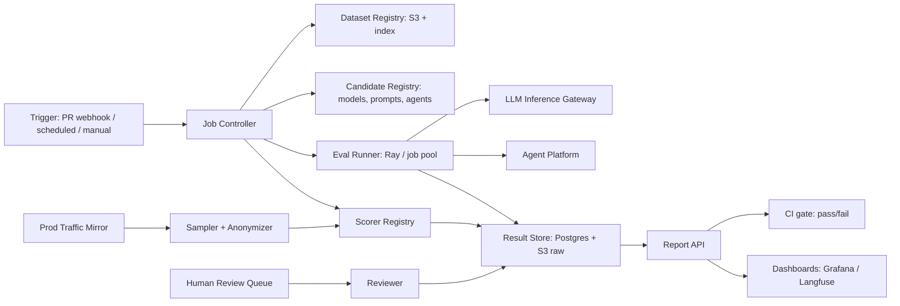

# System Design: LLM / Agent Evaluation Pipeline at Scale

**Prompt:** Design an offline + online evaluation pipeline for LLM and agent products. Must support golden datasets, model-graded evals, human-in-the-loop, regression detection on every PR, and production traffic mirroring. Target Scale AI / Patronus / Anthropic internal evals.

---

## 1. Requirements

### Functional
- Run eval suites (test sets + scoring fn) against a model or agent endpoint.
- Eval kinds:
  - **Reference-based** (exact match, BLEU, ROUGE, embedding similarity)
  - **Model-graded** (LLM judges another LLM's response)
  - **Heuristic** (regex, JSON-validity)
  - **Human review** (sampled output → reviewer queue)
  - **Multi-turn / agent** (run agent on input scenarios; check trajectories)
- Dataset versioning; dataset slicing (by domain, by tenant).
- Per-PR regression: every change to a prompt / model / agent runs the matching eval suite.
- Online evals: shadow + canary; production traffic sampled, scored, alerted.
- Dashboards: per-suite pass rate, slice-level, time-series.

### Non-functional
- Run a 1k-case suite in <10 min (parallelism).
- Reproducible (frozen model + dataset version).
- Cost-aware (eval is itself expensive at scale).

## 2. Conceptual model

Eval = `(dataset, candidate_endpoint, scorer_fn) -> Report`.

- **Dataset:** versioned, immutable, with metadata per case (tags, slice, ground truth).
- **Candidate:** a (model_id @ version) or (agent_id @ version) or a (prompt_id @ version).
- **Scorer:** pure function `(input, prediction, ground_truth) -> {score, breakdown}`.
- **Report:** aggregate + per-case + slice breakdowns + diff vs baseline.

## 3. Architecture

## 4. Dataset lifecycle

- Each dataset = `(id, version, cases[])`. Append-only; new cases bump version.
- Datasets live in S3 with a Postgres index (id, version, size, schema, owner, slices).
- "Golden" subsets are frozen; "shadow" subsets can grow from production traffic.
- **Slicing** is the most underrated lever: same dataset filtered by `{domain, tenant_segment, language, scenario_type}` produces a slice-level pass rate dashboard. This is what catches regressions that overall pass-rate hides.

## 5. Candidate types

- **Model candidate:** `{provider, model_id, version, sampling_params}`.
- **Prompt candidate:** `{prompt_template_id, version, model_candidate_ref}`.
- **Agent candidate:** `{agent_id, version, agent_config}`.

Promotion gates:
- Model: blind-eval pass > baseline by ε, on N slices.
- Prompt: must beat current prompt on the prompt's owning suite.
- Agent: must pass the agent eval suite + regression on trajectory cost (don't accept higher cost for marginal quality).

## 6. Scorers

- **Heuristic:** in-process functions; cheap; ground-truthed.
- **Reference:** exact / embedding (use embedding service); cheap.
- **Model-graded:** call an LLM judge with a calibrated rubric. Judges are themselves versioned and calibrated against human labels (Cohen's kappa target ≥ 0.7).
- **Multi-turn / agent:** trajectory scoring — did the agent reach a target state? Did it stay within cost budget? Were tool calls valid?
- **Human:** sampled (e.g. 5% of model-graded ones, plus all bottom-quartile by judge score) routed to a reviewer pool.

## 7. Runner

- Ray actor pool. Each actor processes (case → candidate.predict() → scorer.score()) → emit result.
- Concurrency tuned per candidate's RPS budget.
- Idempotent: case+candidate+scorer triple → deterministic result_id.
- **Caching**: if candidate version + case version + sampling params unchanged, reuse the prediction.

## 8. CI integration

- PR opens → CI hook → look up the changed artifact (prompt? agent? model?). Find suites attached. Run smaller smoke-suite (~50 cases) inline. Block merge on regression.
- Nightly full suite. Weekly grand suite (everything).
- Result API exposes `pass_rate_delta` and `confidence_interval`; CI gate uses both (don't block on 1 case noise).

## 9. Online evals

- Sample 1-5% of production traffic. Anonymize (PII redactor as middleware). Run model-graded scorers async.
- Detect drift: time-series alarm on rolling pass-rate.
- Sentry-like incident creation when drift > threshold; auto-link to recent deploys.

## 10. Cost control

- Eval is itself a meaningful LLM bill. Apply the same cost-governance pattern as my OpenClaw work:
  - Per-suite cost budget per run.
  - Per-judge call accounting; warn when judge model dominates cost.
  - Caching of judge scores keyed on `(judge_id, candidate_output_hash, rubric_id)`.

## 11. Tenant / org scope

- Datasets and suites are owned by orgs / teams. RBAC: read / run / write.
- Cross-org sharing: dataset can be "published" to a shared catalog (read-only).

## 12. Observability

- Per run: run_id, candidate, suite, slice_breakdown, p95 latency, total cost, pass_rate, vs_baseline_delta.
- Per case: prediction, score, judge_reasoning (when LLM-graded), human_label (when sampled).
- Trace store: all judge calls in Langfuse-style traces.

## 13. Failure modes

| Failure | Mitigation |
|---------|------------|
| Judge LLM regresses | Pin judge version; recalibrate against human labels quarterly |
| Dataset leak (model trained on test) | Dataset hashes published; train pipelines check against a holdout-leakage set |
| Non-determinism in candidate | Pin sampling params; report mean + variance across seeds |
| Slow suite blocks CI | Smoke-suite inline; full suite async; PR comment with link |
| Reviewer fatigue | Sampled queue with rotation; calibrate via gold cases |

## 14. What I'd ask

- "Is the primary consumer of evals a research team optimizing models, or a product team gating deploys? Affects the UX of reports."
- "Multi-turn / agent evals expected from day 1?"
- "How much production traffic mirroring is acceptable from a privacy standpoint?"

## 15. Senior-sounding lines

- "Slices are how you catch regressions overall pass-rate hides. I'd invest in slice infra before fancy judges."
- "Treat the judge LLM as a versioned, calibrated artifact — kappa against human ≥ 0.7 or it's not in production."
- "Caching the judge call is the single biggest cost lever after batching."

---

## Source notes

- OpenAI evals repo (case structure).
- Anthropic blog on eval methodology.
- Patronus AI product (online evals).
- Scale AI's RLHF + eval ops (public talks).
- Langfuse trace structure for evals.
