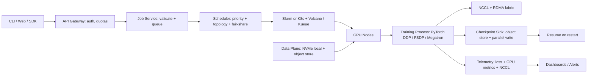

# System Design: Distributed Training Orchestration

**Prompt:** Design the orchestration platform that runs distributed training jobs for a frontier-lab. Supports thousands of GPUs, multi-node multi-GPU (NCCL / NVLink), checkpoint / restart, preemption, multi-tenancy across research teams, and observability. Targets Anthropic, OpenAI, Mistral, xAI, Together.

---

## 1. Requirements

### Functional
- Submit a training job declaratively: image, command, resources (GPUs, RAM, NIC), data location, env, secrets.
- Multi-node, multi-GPU jobs (16-1024+ GPUs). Topology-aware (rack, NVLink islands, RDMA).
- Checkpoint / restart with bit-for-bit resume.
- Preemption + requeue (a higher-priority job can take resources back).
- Job queue with priority + fair-share across teams.
- Observability: GPU utilization, NCCL throughput, loss curves, OOMs.
- Hyperparameter sweep abstraction (parent job → many child trials).

### Non-functional
- 90%+ GPU utilization at fleet level.
- Job submission to first iteration < 60 s for cached images and pre-staged datasets.
- Failure rate of "node died mid-training" handled within minutes, not hours.

## 2. Architecture

## 3. Scheduler design

The hardest single decision: **K8s+Volcano/Kueue** or **Slurm**.

- **Slurm:** dominant in HPC. Mature for distributed training (gang scheduling, topology-aware allocation). Less cloud-native.
- **K8s + Volcano/Kueue:** modern, integrates with K8s ecosystem. Gang-scheduling exists but is younger.

Senior answer: use Slurm for tightly-coupled training (multi-node, NCCL-heavy) and K8s for inference + lightweight training. Don't try to put one ring to rule them all.

### Gang scheduling
A training job is N pods that must start together or not at all. Volcano / Kueue / Slurm all support this. Tested edge case: partial start → kill all → requeue.

### Topology awareness
- NCCL throughput depends on whether nodes are in the same NVLink island (intra-node), same NVSwitch domain (across nodes via NVLink), or cross-rack (over IB / RoCE).
- Scheduler should prefer co-located placements; record actual placement so post-hoc analysis matches measurements.

### Fair-share + priority
- Hierarchical fair-share by team. Within team, FIFO with priority overrides.
- "Backfill" lower-priority jobs into spare capacity to keep utilization up; preempt when high-priority jobs arrive.
- Per-team GPU budget enforced in admission control.

## 4. Checkpoint / restart

- Checkpoint sink = object store (S3 / GCS) with parallel multipart upload.
- For 70B-parameter models, checkpoints are hundreds of GB; write must be parallelized across ranks (e.g. PyTorch FSDP sharded checkpoints).
- **Async checkpoint:** copy from GPU → host → object store off the training critical path; never block training while a checkpoint flushes.
- Checkpoint hygiene: keep last N + every Mth + every named (epoch start) — rotation policy.

## 5. Data plane

- Datasets staged once to local NVMe per node; shared via a read-only mount.
- For very large datasets, a streaming dataloader from object store with prefetch.
- A shared **dataset registry** so jobs declare their dataset by ID + version, not a path. Improves reproducibility.

## 6. Failure handling

- **Node dies:** scheduler marks the node tainted; restarts the job from the last checkpoint on healthy nodes. Replace the failed node, requeue.
- **Slow node ("straggler"):** detect via per-rank step-time deviation; in egregious cases, drop the rank and rerun with -1 GPU; otherwise alert.
- **NCCL hang:** detect via heartbeat from a sidecar; capture stack traces; kill + checkpoint-resume.
- **Datacenter-level event:** multi-region replication of checkpoints; resume in another region requires the image registry + data plane in that region.

## 7. Observability

- **Per job:** loss curves, throughput (tokens/sec), per-rank step time, GPU utilization, comms time (NCCL allreduce), memory.
- **Per node:** GPU temp, ECC errors, NCCL throughput, NIC errors.
- **Per fleet:** utilization heatmap, queue depth by priority class, oldest unscheduled job.
- Telemetry: DCGM exporters + custom NCCL profiler + per-rank PyTorch profiler samples. Time-series in Prometheus / VictoriaMetrics; traces in Tempo.

## 8. Multi-tenancy

- Per-team K8s namespaces / Slurm accounts.
- Per-team quotas: total GPUs, max job size, max wallclock.
- Image registry with per-team scopes; never pull-from-internet on a training node.
- Secrets via Vault; service-account-style auth for object store.

## 9. Hyperparameter sweeps

- Parent job describes a sweep: search space, budget, search algorithm (grid / random / Optuna / Hyperband).
- Sweep controller spawns child jobs as resources free up.
- Trial results stored in a sweep registry, plotted in dashboards.

## 10. Cost levers

- Reserved capacity for production training; spot/preemptible for sweeps + research exploration.
- "Elastic" training (PyTorch elastic) for sweeps: jobs can shrink/grow with capacity.
- Aggressively retire idle resources after a job's checkpoint completes.

## 11. Failure modes

| Failure | Mitigation |
|---------|------------|
| Gang scheduling deadlock under heavy demand | Maximum job-size cap + reservation system |
| Checkpoint flush blocks training | Async checkpoint sidecar; backpressure visible in metrics |
| Cross-rack NCCL fall-back due to placement bug | Topology-aware scheduler with co-location SLOs |
| Researcher submits a sweep that swamps a team's quota | Sweep controller enforces per-team trial budget |
| Stale image cache after a security patch | Image registry mirrors per region with TTL |
| Spot reclaim mid-iteration | Elastic training + frequent checkpoints |

## 12. What I'd ask the interviewer

- "What fraction of jobs are multi-node? That changes scheduler choice."
- "Is the workload mostly pretraining (long jobs) or fine-tuning (short jobs)?"
- "Do you need topology-aware placement as an SLO, or as a best-effort?"

## 13. Senior-sounding lines

- "Don't use one orchestrator for everything; Slurm and K8s have different sweet spots."
- "Async checkpoint is the difference between 80% and 95% utilization."
- "Topology awareness is an SLO; you measure it post-hoc and alert when allocations regress."

---

## Source notes

- "Megatron-LM" paper (NVIDIA) for parallelism patterns.
- "FSDP" PyTorch docs.
- Slurm + Volcano docs.
- Anyscale Ray Train (alternative orchestrator).
- Anthropic / OpenAI public talks on training infra.
