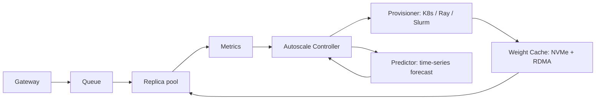

# System Design: GPU Autoscaling for Inference

**Prompt:** Design the autoscaling system for GPU-backed inference at a frontier-lab or serverless-GPU shop. Goal: fast scale-out under bursty load, fast scale-in to control cost, no SLO violations during scaling, and minimal cold-start tax.

Targets Modal, Together AI, Anthropic, Fireworks, Baseten.

---

## 1. Why GPU autoscaling is different

- **Weights are huge** (a 70B model is 140 GB FP16). Loading them onto a fresh GPU node can take minutes if you're naive.
- **Spot/preemptible interrupts** are a normal failure mode.
- **Warm-up is non-trivial:** CUDA kernel autotune, NCCL handshake, KV cache priming all happen on first request and dominate the first request's latency.
- **Per-replica throughput is non-linear** (continuous batching helps; saturation hurts tail latency).

A reasonable CPU autoscaler is wrong for GPU. The signal isn't CPU; it's **queue depth + tokens in flight + acceptance latency vs SLO**.

## 2. Signals

For each (model, traffic class) pool:

- **Queue depth** (req in queue, not yet on a replica).
- **In-flight tokens / sec** per replica.
- **TTFT (time-to-first-token)** p95 over a sliding window vs SLO.
- **TPOT (time-per-output-token)** p95 vs SLO.
- **Replica saturation:** KV cache occupancy.

Headroom = `target_TTFT_p95 - observed_TTFT_p95`. If headroom negative or shrinking, scale out. If headroom large for K minutes, scale in (slowly).

## 3. Control loop



- Controller runs every ~5 s.
- It both **reacts** to the last 30 s of signals and **predicts** the next 5 min from a time-series model (e.g. EWMA + day-of-week seasonality).
- Predictor lets you pre-warm before the peak instead of chasing it.

## 4. Weight cache (cold-start mitigation)

The biggest unlock: **weight cache** that delivers weights to a fresh GPU in seconds, not minutes.

- Tier 1: GPU NVMe direct (warmest; one model loaded).
- Tier 2: node-local NVMe (next model warm-cache).
- Tier 3: regional weight cache (RDMA-readable from neighbor nodes).
- Tier 4: object store (cold).

Prewarming = stage tier-2 weights for the next likely model before traffic arrives.

## 5. Replica lifecycle

State machine:

```
provisioning -> warming -> ready -> draining -> terminated
```

- **Provisioning:** GPU node assigned, image pulled, weight pulled to NVMe.
- **Warming:** weights loaded into VRAM, CUDA graphs/JIT done, one synthetic request to prime KV.
- **Ready:** added to load-balancer.
- **Draining:** removed from LB; in-flight requests finish; KV cache flushed.
- **Terminated:** node released.

Each state has a budget (max time + alerts). Draining must complete before terminate — never kill in-flight.

## 6. Scale-out

- Trigger when queue depth grows or TTFT degrades.
- Provision in parallel — never one-replica-at-a-time during a burst.
- Use a **provisioning buffer** (e.g. 10-20% of current capacity always pre-provisioned but not in LB) for instant pop-in. Buffer adjusts to forecast.

## 7. Scale-in

- Conservative. Faster scale-in than scale-out increases SLO violations.
- Required cool-down (e.g. 5 min of low load before considering scale-in).
- Scale-in policy: drain the **least recently used** replica first.
- Per-model floor (e.g. minimum 2 replicas always on, even at zero traffic) — sets the latency floor for the next request.

## 8. Spot/preemptible handling

- Spot replicas have a "may-be-reclaimed" flag.
- Provisioner monitors cloud preemption signals; once a 2-min warning fires:
  - Mark replica `draining`.
  - Provision a replacement on on-demand.
  - Reroute traffic.
- Spot used for Tier-2 / batch traffic; never as the only home for the latency-critical Tier-0 pool.

## 9. Multi-model fleet

When the fleet hosts dozens of models:

- Cross-model bin-packing: a node with spare VRAM can host a smaller model's replica.
- Adapter-based serving (LoRA) shares base weights — same idea, lower granularity.
- "Hot model" set kept warm 24/7; "cold model" set scaled to zero with first-request cold-start tolerance documented.

## 10. Observability

- **Per pool:** replicas (provisioning/warming/ready/draining), queue depth, TTFT/TPOT histograms vs SLO, $/hour, utilization.
- **Per replica:** TTL, weights-cache-hit, warmup duration, requests served.
- **Per autoscale decision:** signals at decision time, action taken, observed effect 60 s later (control-loop self-evaluation).
- Self-eval lets you tune controller gains without flying blind.

## 11. Failure modes

| Failure | Mitigation |
|---------|------------|
| Scale-out lag → SLO violation during burst | Predictor + provisioning buffer |
| Scale-in too aggressive → flapping | Cool-down + hysteresis |
| Cold start dominates first-request latency | Weight cache tiers + pre-warm |
| Spot reclaim storm | Avoid spot for Tier-0; have on-demand budget headroom |
| Cross-model bin-pack conflict (one model OOMs another) | Reserve per-replica VRAM headroom; reject co-host if budget too tight |
| Controller bug ramps replicas to limit | Hard fleet cap + paging alarm |

## 12. What I'd ask the interviewer

- "What's the latency SLO at the request level vs the iteration level?"
- "How much budget can we put into a weight cache, and on what storage tier?"
- "What's the workload's burstiness — flash crowd or steady?"

## 13. Senior-sounding lines

- "CPU is not the signal; queue depth + token throughput + SLO headroom is."
- "Weight cache is the single best engineering investment for cold-start tax."
- "Predict + react. React-only autoscalers will always chase the peak."
- "Scale-out must be parallel. One replica at a time during a burst is malpractice."
- "Self-evaluate every decision; controller-tuning is data, not vibes."

---

## Source notes

- Modal blog on cold-start engineering.
- "Continuous batching" (Anyscale).
- KubeCon talks on Karpenter + GPU.
- NVIDIA Triton dynamic batching docs.
