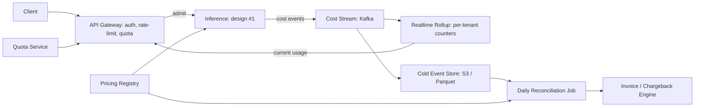

# System Design: Multi-Tenant Inference Cost Attribution + Chargeback

**Prompt:** You run a shared inference platform across many internal teams (or external tenants). Design the system that fairly attributes cost, enforces quotas, and exposes accurate per-tenant chargeback. (Sibling design to #1, focused on the cost / billing / quota plane rather than the serving plane.)

Highly relevant for any Staff+ role at Anthropic, OpenAI, Databricks, Modal, Together, internal AI platforms at FAANG.

---

## 1. Why this is hard

- Cost lives in many places: GPU-hour, network egress, KV cache memory, object storage, eval calls, judge calls.
- Multi-tenant fleets bin-pack workloads → no clean 1:1 between tenant and replica.
- Quotas need to be enforced in **real time** at the request gate, but accurate cost computation needs **post-hoc** reconciliation from the provider/cloud bill.
- Tenants want transparency; finance wants accuracy; engineering wants neither system to be expensive itself.

## 2. Cost model

Per-request cost decomposition:

```
cost_per_request = 
    cost_input_tokens   = input_tokens   * model_price.input_per_1k   / 1000
  + cost_output_tokens  = output_tokens  * model_price.output_per_1k  / 1000
  + cost_cache_lookup   = cached_tokens  * model_price.cache_per_1k   / 1000  (negative — credit)
  + cost_per_request    = base_per_request_fee
  + cost_tooling        = sum(tool_call.cost for tool_call in request.tools)
  + cost_eval_overhead  = (eval_sampled ? eval_unit_cost : 0)
  + cost_storage        = pro_rata_storage_cost  (rolled up daily)
  + cost_network_egress = pro_rata_egress_cost  (rolled up daily)
```

Cost lives in two registries:

- **Hot:** per-request, real-time, used for quotas and rate limiting (potentially with approximations).
- **Cold:** end-of-day, reconciled against vendor invoice and cloud bill.

## 3. Architecture



## 4. Quota enforcement at the gate

Real-time, sub-millisecond:

- Token-bucket per tenant for: requests/sec, tokens/min, $/hour.
- Counters live in Redis-cluster with TTL; updated on every accepted request.
- Hard quota = reject at gate. Soft quota = allow with `degraded=true` header + alert.
- Headroom for tail latency in the counter check (no synchronous fetch from DB).

## 5. Pricing registry

(Drawn directly from OpenClaw cost-aware runtime work — manual pricing overrides as a first-class feature.)

- Source of truth: per-model price record `{model_id, prompt_per_1k, completion_per_1k, cache_per_1k, base_per_request, effective_date}`.
- **Manual override** per (tenant, model) for negotiated rates.
- Hot-reloadable: change effective immediately; new requests use new prices.
- Reconciliation job picks the price record valid at the request's timestamp (slowly-changing-dimension pattern).

## 6. Streaming + storage

- Cost event = `(request_id, tenant_id, model_id, timestamp, tokens_in, tokens_out, cache_hit, tool_calls[], pre_aggregated_cost)`.
- Stream: Kafka with `tenant_id` as partition key → consumer parallelism scales with tenants.
- Cold store: events written to S3 as Parquet partitioned by `(date, tenant_id)`.
- Day-end: Spark/Trino job recomputes daily cost per tenant from cold store, comparing against the realtime rollup and the vendor invoice.

## 7. Bin-packing reconciliation

When tenants share replicas, per-replica costs (GPU-hour, storage) don't map 1:1 to tenants:

- Track per-replica `(tenant_id, tokens_served, request_time_share)` over each hour.
- Allocate hourly GPU cost proportional to `tokens_served * model_factor + request_time_share * time_factor`.
- Document the allocation policy publicly to tenants. "Fair" is fine — "fair *and* documented" is what builds trust.

## 8. Eval / overhead costs

Don't hide them — break them out on the invoice:

- Evaluation calls (model-graded scoring) are billed to the tenant whose model is being graded, at the eval-judge's per-token price.
- Safety / policy filter calls billed at a flat overhead per request (since they don't scale with request size).

## 9. Dashboards

Per tenant:

- Current $/hour, $ this month, projection.
- Top models by spend, top tools by spend.
- Quota burn-down.
- Anomaly markers (cost spike or steep RPS drop).

Per platform (internal):

- Total $/hour from cost-event stream vs vendor bill (gap should track close to zero).
- Per-tenant gross margin (when relevant for product pricing).
- Reconciliation drift over time (rolling 30-day chart).

## 10. Failure modes

| Failure | Mitigation |
|---------|------------|
| Cost-event loss → tenant underbilled | Two-source reconciliation: event stream + vendor invoice; gap exceeds 1% → alert |
| Hot pricing change applied mid-flight → confusing invoice | Pricing records have `effective_date`; allocation joins on request timestamp |
| Tenant abuses cache-discount to spike requests | Cache discount only if upstream provider also discounted; verify against vendor invoice |
| Quota check stale by seconds → over-burn | Token bucket refresh interval is short; hard quotas have headroom buffer |
| Bin-pack allocation disputes | Allocation policy documented + per-tenant detail page; allow tenant to audit |

## 11. What I'd ask

- "Are tenants internal teams (chargeback) or external (revenue)? Changes the accuracy bar."
- "How precise must hot quota be — to the cent, or to the dollar?"
- "Are we passing through vendor cost, or marking up?"

## 12. Senior-sounding lines

- "Cost is a first-class signal at every step boundary, not a billing afterthought — that's the most important architectural choice."
- "Two-source reconciliation is non-negotiable: cost-event stream is your hot truth, vendor invoice is your cold truth. The gap is your bug list."
- "Pricing is slowly-changing-dimension. Effective dates on everything; allocation joins on request time."
- "Document your bin-packing allocation; tenants don't expect perfect, they expect understandable."

---

## Source notes

- OpenClaw cost-aware runtime (my own work) — manual pricing overrides.
- AWS billing service architecture (public deck).
- Snowflake credit-attribution model.
- "Building a billing system" (Stripe blog).
