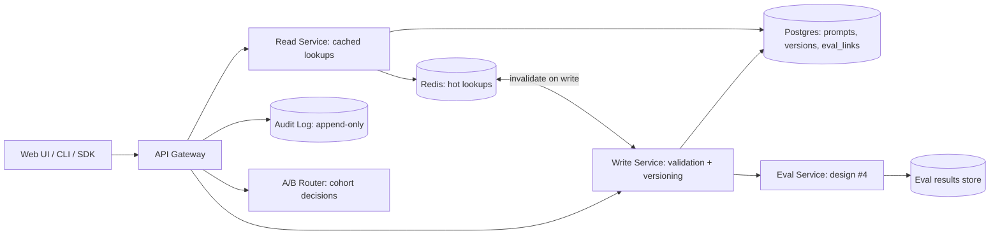

# System Design: Prompt + Eval Registry

**Prompt:** Design a registry that versions prompts, prompt templates, and the eval suites that gate them, used across many product teams in a large org. Think the internal control plane for "what prompt is in production right now, and how do we know it's not broken."

Targets Cursor, Anthropic, Sierra, Decagon, Glean, internal AI platforms.

---

## 1. Requirements

### Functional
- Register a prompt (or prompt template) with metadata: id, version, owner, model affinity, latest tested eval suite.
- Diff between prompt versions.
- Promote a prompt from draft → staging → production with gates.
- Attach eval suites to a prompt; require pass before promotion.
- A/B test two versions in production with cohorting.
- Audit: who promoted what, when, with what eval result.

### Non-functional
- Read-heavy (production looks up active prompt on every request).
- p99 lookup < 10 ms (in-cache).
- Strong consistency on writes; eventual on reads with cache invalidation.
- Per-team RBAC.

## 2. Conceptual model

```
PromptTemplate {
  id: "support-triage-claude",
  versions: [
    Version {
      id: 1, body, model, params, owner, created_at, hash,
      eval_results: [ {suite_id, version, pass_rate, ci, run_id, judged_by} ],
      gate_state: {draft|staging|production|deprecated}
    },
    Version { id: 2, ... },
  ],
  active_version_per_env: { "prod": 1, "staging": 2 }
}
```

Prompts are immutable per version; "edit" creates a new version. (Git-like model.)

## 3. Architecture



## 4. Promotion gate

Promotion to production requires:

1. Eval suite linked to the prompt has been run on this version, within N days.
2. `pass_rate` ≥ `baseline_pass_rate + epsilon`, with confidence interval not crossing baseline.
3. Per-slice regression check: no slice drops more than M% relative to baseline.
4. Cost regression check: per-call cost not greater than `baseline_cost * (1 + cost_tolerance)`.
5. Owner approves; second reviewer approves for production tier.

If any gate fails: PR-style blocked state with a link to the failing dashboard.

## 5. A/B testing

- Promotion to production isn't binary — first 5% of traffic goes to the new version, monitor for 24 h, then 25%, then 100%.
- Cohort decision is sticky per `tenant_id` (or per `user_id`, depending on product) so the same caller sees consistent prompts.
- Online eval results recorded by cohort; auto-rollback if the new cohort regresses by ≥ K% on a key metric.

## 6. Diff + reasoning capture

- Side-by-side diff for prompt body, parameters, attached tools.
- Each new version requires a 1-sentence reason ("why this change") — captured in metadata.
- Optional: an LLM-generated summary of the diff for reviewer convenience.

## 7. RBAC and per-team scoping

- Each prompt template owned by a team.
- Read: org-wide by default; opt-in private.
- Write: team members.
- Promote to production: senior reviewers per team.
- Audit log is append-only; signed.

## 8. SDK / runtime usage

- Application code refers to prompts by `(template_id, env)` — not by raw body.
- SDK fetches the active version once on startup, caches with a short TTL (e.g. 60 s).
- A push-invalidation channel (Redis pub/sub) accelerates rollouts.

## 9. Observability

- Per template per version: usage rate, p95 latency, judged pass rate (online evals), cost per call.
- Per change: time from draft to staging to production.
- Stale-version detector: prompts not used in 90 days are auto-deprecated (alerts owner first).

## 10. Failure modes

| Failure | Mitigation |
|---------|------------|
| Newly-promoted prompt silently regresses cost | Cost regression gate; online cost monitor with alert |
| Cache stale after a critical fix | Push invalidation + short TTL fallback |
| A/B cohort imbalance | Stickiness + cohort-size monitor |
| Eval suite linked but never re-run | "Eval stale" gate prevents promotion |
| Prompt drift (same template, different ad-hoc body in code) | SDK fetches by id; static linter forbids inline prompts in code |
| Cross-team prompt name collision | Namespaces (`team_id/template_id`) |

## 11. Storage / scale

- Postgres for prompts + metadata + eval-link table (modest scale; tens of thousands of records).
- Redis for active-version cache.
- S3 (or DB blob) for full prompt bodies if they get large (multi-page system prompts).

## 12. What I'd ask

- "How tight is the SLO on lookup latency? That changes the cache story."
- "Are prompts ever generated dynamically per request, or always template-resolved?"
- "How strict is per-team isolation? Affects whether we go shared schema or per-team."

## 13. Senior-sounding lines

- "Prompts are code. Version them, diff them, gate them with tests, audit them."
- "The eval-suite link is the most important field on a prompt version. Anything you can't auto-test you can't safely promote."
- "Stickiness in A/B cohorts is mandatory for product-shaped agent UX. Customers notice when an answer flips between prompts."
- "Cost regression is a promotion gate, not a follow-up. Once it's a follow-up, it never gets fixed."

---

## Source notes

- Anthropic Workbench (public references).
- OpenAI evals + prompt versioning (OSS repo).
- LangSmith prompt registry features.
- Internal patterns from Sierra, Decagon (public talks).
